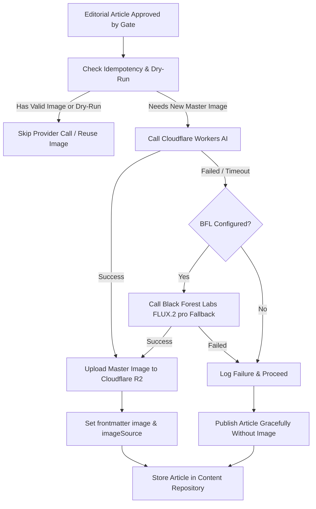

# LifeMode Editorial Visual Content & Image Strategy

## 1. Executive Summary & Visual Direction

LifeMode is a contemporary, global lifestyle and cultural publication. The visual direction is rooted in documentary lifestyle editorial photography, taking inspiration from the restrained, warm, and tactile aesthetics of print publications such as *Kinfolk*, *Cereal*, *Monocle*, and *Wallpaper\**.

The visual system is designed to provide high-quality photographic assets for:
- Website Article Heroes (`16:9` / `3:2`)
- Article Card Grid Previews (`4:3`)
- Social Media Distribution (Pinterest `2:3` / `9:16`, Instagram `1:1` / `4:5`, Facebook `1.91:1` / `16:9`)
- Content Feeds and OpenGraph metadata

---

## 2. Core Image Guidelines & Prohibitions

### Editorial Guidelines
* **Authentic Realism**: Pure photographic style. Natural daylight, warm directional lighting, soft ambient illumination.
* **Tactile Textures**: Organic surfaces such as washed linen, matte ceramic, untreated oak/walnut, lime-washed plaster, paper stationery, and natural flora.
* **Photographic Craft**: Emulates prime lens documentary capture (35mm, 50mm, 85mm prime lenses with subtle natural depth of field `f/1.8`–`f/2.8` and gentle 35mm film grain).
* **Magazine Framing**: Clean asymmetric compositions with intentional negative space, allowing for uncluttered editorial presentation.

### Prohibitions (Negative Prompt Directives)
* ❌ **No Text or Typography**: No text overlays, floating letters, simulated logos, or watermarks.
* ❌ **No Neon or Sci-Fi Glows**: No cyan/magenta lasers, cyber grids, or futuristic artificial illumination (even for `tech-ai`).
* ❌ **No Generic Stock Photography**: No staged corporate handshakes, exaggerated boardroom smiles, or sterile white-background studio portraits.
* ❌ **No 3D CGI or Video Game Graphics**: No plastic rendering, vector illustrations, or cartoon character models.
* ❌ **No Harsh Flash**: No harsh direct on-camera flash or artificial fluorescent saturation.

---

## 3. Pillar-Specific Visual Identities

LifeMode organizes its coverage across seven core pillars, each defined with specific lighting, color palettes, and visual motifs in `src/config/images.ts`:

| Pillar | Theme & Mood | Visual Motifs | Palette | Lens & Perspective |
| :--- | :--- | :--- | :--- | :--- |
| **`life`** | Intentional Living & Daily Rituals (*Tranquil, tactile, warm*) | Sunlit morning domestic spaces, ceramic mugs, coffee brewing, open notebooks, candid human presence | Linen, Terracotta Rose, Soft Birch, Clay Taupe | 50mm f/1.8 prime lens, intimate eye-level |
| **`travel`** | Slow Journeys & Cultural Landscapes (*Wanderlust, timeless, contemplative*) | Coastal stone promenades, Mediterranean facades, slow rail journeys, artisanal workshops, mountain vistas | Coast Azure, Weathered Sand, Olive, Sun-bleached Stone | 35mm f/2.0 lens, expansive documentary landscape |
| **`tech-ai`** | Human Intelligence & Thoughtful Tools (*Focused, human-centric, tactile*) | Minimalist designer studios, walnut desks, matte mechanical keyboards, analog sketching alongside hardware | Mineral Violet, Charcoal Slate, Matte Silver, Warm White | 50mm f/1.4 lens, selective focus on tactile workspace details |
| **`money`** | Strategic Clarity & Sustainable Freedom (*Sophisticated, grounded, steady*) | Architectural libraries, bespoke leather folios, morning skyline views, calm analytical environments | Sage Slate, Rich Espresso, Parchment Cream, Burnished Brass | 45mm tilt-shift / 50mm f/2.8 lens, clean geometric framing |
| **`wellbeing`** | Mindfulness, Longevity & Rest (*Peaceful, restorative, serene*) | Morning sunlight over unmade linen bedding, herbal tea bowls, tranquil reflecting pools, lush botanical gardens | Raw Amber, Botanical Sage, Oatmeal, Morning Dew White | 85mm f/1.8 lens, creamy bokeh, intimate stillness |
| **`discover`** | Curated Culture, Books & Design (*Curious, cultured, aesthetic*) | Gallery exhibition sculptures, public library skylights, mid-century furniture, art monographs, architectural models | Warm Umber, Ochre Gold, Museum White, Aged Paper | 35mm f/2.8 lens, balanced architectural perspective |
| **`now`** | Cultural Signals & Modern Zeitgeist (*Timely, observant, energetic*) | Candid street documentary in creative districts, espresso bar terraces, contemporary pop-up concept spaces | Editorial Madder, Deep Charcoal, Concrete Grey, Warm Amber | 28mm / 35mm f/2.0 street documentary perspective |

---

## 4. Article Frontmatter Metadata Schema

The article collection schema (`src/content.config.ts`) and storage serializers support the following optional image fields:

```yaml
---
title: "The Architecture of Quiet Routines"
description: "How intentional spaces and tactile morning rituals foster deep creative focus."
pubDate: 2026-09-10
pillar: "life"
tags: ["rituals", "design", "focus"]
readingTime: "5 min read"
format: "essay"
image: "/images/editorial/life/architecture-quiet-routines.webp"
imageAlt: "A sunlit morning kitchen counter with hand-poured coffee and an open journal"
imagePrompt: "Editorial photography for high-end lifestyle magazine LifeMode. Subject: The Architecture of Quiet Routines..."
imageSource: "ai-generated" # Or "editorial", "unsplash", "archive"
---
```

### Schema Field Reference
* `image` *(optional `string`)*: Absolute web path or public URL to the article's hero image.
* `imageAlt` *(optional `string`)*: Descriptive accessibility alt text for screen readers and SEO.
* `imagePrompt` *(optional `string`)*: The fully composed AI generation prompt generated during editorial pipeline execution.
* `imageSource` *(optional `string`)*: Provenance of the image (e.g. `ai-generated`, `editorial-archive`, `manual`).

---

## 5. Editorial Prompt Generation Pipeline

The generation module (`src/lib/editorial/image-prompt.ts`) automatically constructs ready-to-use image prompts during article generation:

```typescript
import { generateEditorialImagePrompt } from './lib/editorial/image-prompt';

const result = generateEditorialImagePrompt({
  title: 'The Art of Mindful Solitude',
  description: 'Exploring quiet contemplation and rest in modern life.',
  pillar: 'wellbeing',
  tags: ['mindfulness', 'rest', 'solitude'],
  aspectRatio: 'hero', // 'hero' | 'card' | 'socialStory' | 'socialSquare'
});

// Output:
// {
//   prompt: "Editorial photography for high-end lifestyle magazine LifeMode. Subject: The Art of Mindful Solitude...",
//   negativePrompt: "No text overlays, typography, words, or letters, No watermarks...",
//   recommendedAspectRatio: "16:9",
//   altText: "The Art of Mindful Solitude — editorial photography exploring mindfulness, longevity & rest",
//   visualTheme: "Mindfulness, Longevity & Rest"
// }
```

During editorial publishing package building (`src/lib/editorial/publishing/builder.ts`), `imageMetadata` is automatically attached to the package with `prompt`, `recommendedAspectRatio`, and `source: 'generation-ready'`.

---

## 6. Elegant Fallback System

When an article does not possess a rendered image file in `image`:
1. **ArticleCard** (`src/components/ArticleCard.astro`): Renders a rich, pillar-themed editorial placeholder featuring the pillar's distinct gradient mesh, monogram seal, and ambient lighting texture.
2. **Article Page** (`src/pages/[pillar]/[...slug].astro`): Renders a refined typographic layout with the article title, excerpt, metadata, and pillar-themed header accents without layout shifts.

---

## 7. Production Automated AI Image Generation Pipeline

The editorial image generation pipeline uses a cost-optimized, dual-provider architecture:

1. **Primary Provider**: **Cloudflare Workers AI** (`@cf/black-forest-labs/flux-1-schnell`). Fast, highly cost-efficient image generation.
2. **Fallback Provider**: **Black Forest Labs FLUX.2 [pro] / FLUX 1.1 [pro]** (`flux-pro-1.1`). High-fidelity fallback triggered strictly when Cloudflare Workers AI fails.
3. **Master Asset Storage**: **Cloudflare R2 Storage** (`editorial/{topicId}/{contentHash}.jpg`). Master image uploaded and public HTTPS URL persisted to frontmatter.



### Key Operational Rules

* **Cost Minimization**: All normal generations route to Cloudflare Workers AI first. BFL is strictly called as a fallback.
* **Non-blocking Resilience**: Image generation failure will **never** fail or abort article publication. If both providers or R2 fail, the article publishes normally with `imagePrompt` and `imageAlt` preserved for elegant fallback rendering.
* **Idempotency**: Existing images are preserved. Rerunning publishing for an article with a valid image will never regenerate or re-upload.
* **Dry-Run & Feature Flagging**: Setting `LIFEMODE_AUTOMATION_DRY_RUN=true` or `LIFEMODE_IMAGE_ENABLED=false` bypasses all external image provider and R2 network calls.
* **Deterministic Logging**: Machine-readable logging tracking provider execution:
  - `[IMAGE] article=<id> provider=cloudflare status=success`
  - `[IMAGE] article=<id> provider=cloudflare status=failed fallback=bfl`
  - `[IMAGE] article=<id> provider=bfl status=success`
  - `[IMAGE] article=<id> status=failed publication=continued`
  - `[IMAGE] article=<id> status=skipped reason=dry-run`

